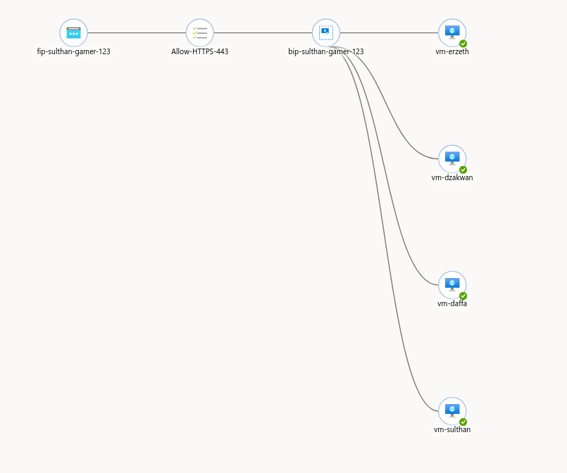
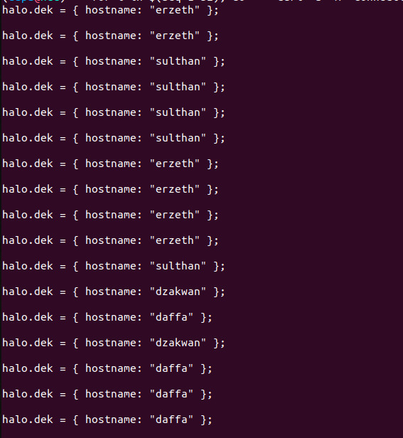
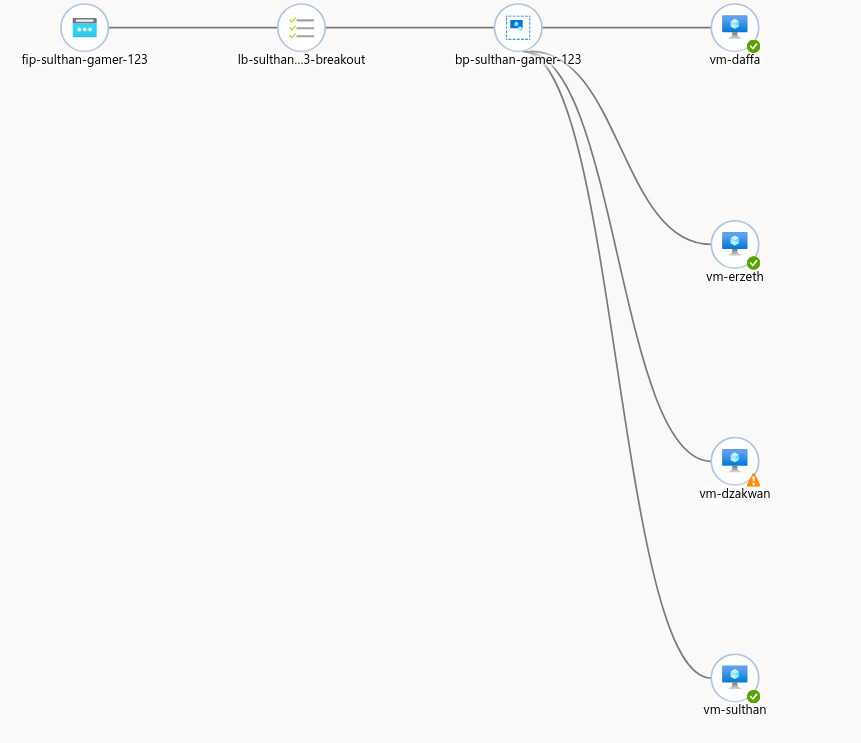
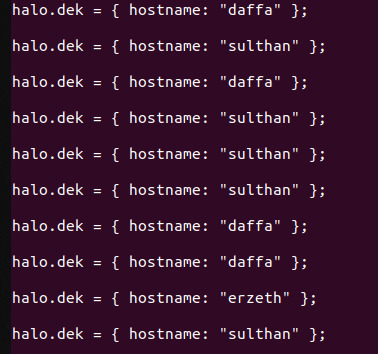
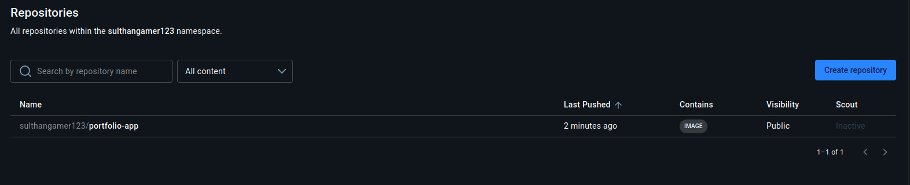
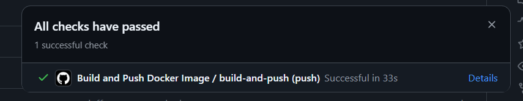

# Lab Based Education (LBE) Final Capstone Project
 
## Project Overview
Proyek ini merupakan tugas akhir untuk *Lab Based Education (LBE) Workshop*. Sistem ini mengimplementasikan infrastruktur *cloud* yang resilient dan handal menggunakan **Azure Standard Load Balancer** untuk mendistribusikan lalu lintas **HTTPS (Port 443)** ke 4 Virtual Machine (VM) Ubuntu. Masing-masing VM menjalankan dua kontainer Docker: **Caddy** (reverse proxy sekaligus TLS terminator) dan **Nginx** yang menyajikan aplikasi portofolio anggota tim.
 
---
 
## Team Members & Roles
 
| Name | Role | VM Name | Username / Hostname |
| --- | --- | --- | --- |
| **Erzeth** | VM **dengan** Public IP | `vm-erzeth` | `erzeth` |
| **Daffa** | VM tanpa Public IP | `vm-daffa` | `daffa` |
| **Sulthan** | VM tanpa Public IP | `vm-sulthan` | `sulthan` |
| **Dzakwan** | VM tanpa Public IP | `vm-dzakwan` | `dzakwan` |
 
---
 
## System Architecture
 


 
* **Shared Resource Group & VNet:** Seluruh VM dan Load Balancer berada di dalam satu Resource Group dan Virtual Network yang sama.
* **Domain:** `sulthangamer123.run.place`
* **Frontend Port:** 443 (HTTPS, Akses Publik).
* **Backend Port:** 443, diteruskan ke kontainer Caddy pada setiap VM.
* **TLS Termination:** Ditangani oleh **Caddy** di setiap VM, menggunakan sertifikat dari **Let's Encrypt**.
* **Session Persistence:** `None` (memastikan distribusi koneksi terbagi rata pada Layer 4).
* **NSG:** Inbound rule TCP port 443 diizinkan pada seluruh VM.

---
 
## Application Structure & Deployment
 
Aplikasi menggunakan pendekatan **Unified Docker Image** yang dinamis untuk kontainer portofolio. Satu image Docker memuat seluruh folder portofolio anggota tim, dan memilih folder yang sesuai berdasarkan variabel lingkungan `MEMBER_NAME` yang diinisialisasi dari `$(whoami)` pada setiap VM. Di atasnya, sebuah kontainer **Caddy** menangani HTTPS dan meneruskan trafik ke kontainer portofolio melalui Docker network internal (`webnet`), tanpa perlu membuka port tambahan di host.
 
### Repository Structure
 
```text
.
├── docker-compose.yml
├── .env                          # berisi MEMBER_NAME, berbeda di tiap VM
├── deploy.sh                     # script deploy: set MEMBER_NAME + docker compose up
├── app
│   ├── Dockerfile
│   ├── Caddyfile
│   ├── entrypoint.sh
│   └── src
│       ├── daffa/...
│       ├── dzakwan/...
│       ├── erzeth/...
│       └── sulthan/...
├── docs
│   ├── healthy-backend-pool.png          # ⚠️ perlu diganti
│   ├── healthy-curl-loop-output.jpeg     # ⚠️ perlu diganti
│   ├── one-vm-down-backend-pool.jpeg     # ⚠️ perlu diganti
│   ├── one-vm-down-curl-loop-output.jpeg # ⚠️ perlu diganti
│   ├── nsg-rule-443.png                  # 🆕 tambahkan
│   └── caddy-cert-log.png                # 🆕 tambahkan
└── README.md
```
 
### Build & Offline Distribution Steps
 
Karena hanya `vm-erzeth` yang memiliki akses internet (public IP), image dibangun sekali di `vm-erzeth`, kemudian didistribusikan secara offline ke 3 VM lainnya.
 
**1. Build & Save Image di Jump Server (`vm-erzeth`):**
```bash
docker compose build --no-cache portfolio
docker save -o portfolio-image.tar sulthangamer123/portfolio-app:latest 
docker save -o ~/caddy-image.tar caddy:alpine
```
 
**2. Distribusi Image via Network Lokal (`scp`):**
```bash
scp ~/portfolio-image.tar ~/caddy-image.tar sulthan@10.0.2.4:~/
scp ~/portfolio-image.tar ~/caddy-image.tar dzakwan@10.0.3.4:~/
```

 
**3. Load Image dan Jalankan di Masing-masing VM:**
```bash
docker load -i ~/portfolio-image.tar
docker load -i ~/caddy-image.tar
./deploy.sh
```
 
---
 
## Implementasi HTTPS dengan Caddy & Let's Encrypt
 
Setiap VM menjalankan kontainer Caddy yang secara otomatis memperoleh dan mengelola sertifikat TLS dari Let's Encrypt untuk domain `sulthangamer123.run.place`. Karena 3 dari 4 VM tidak memiliki akses internet langsung, sertifikat diterbitkan satu kali di `vm-erzeth` (satu-satunya VM dengan akses publik), kemudian didistribusikan ke ketiga VM lainnya melalui jaringan privat Azure — sehingga seluruh VM dapat menyajikan HTTPS dengan sertifikat yang valid dan identik tanpa perlu masing-masing menghubungi Let's Encrypt sendiri.
 
```bash
# Di vm-erzeth, setelah sertifikat berhasil diterbitkan:
sudo tar czf caddy-data.tar.gz -C /var/lib/docker/volumes/ /var/lib/docker/volumes/sulthan-gamer-123-lbe-final_caddy_data/_data .

scp caddy-data.tar.gz daffa@10.0.1.4:~/
scp caddy-data.tar.gz dzakwan@10.0.2.4:~/
scp caddy-data.tar.gz sulthan@10.0.3.4:~/
```

Di setiap VM tujuan:
```bash
daffa@vm-daffa:~$ sudo tar xzf ~/caddy-data.tar.gz -C /var/lib/docker/volumes/sulthan-gamer-123-lbe-final_caddy_data/_data
docker compose up -d
```
 
 
## Evidence of Distribution
 
Pengujian distribusi lalu lintas dilakukan menggunakan metode **Curl Loop** dari terminal lokal untuk memastikan pemisahan koneksi TCP pada Layer 4 Azure Standard Load Balancer.
 
### Execution Command
```bash
for i in $(seq 1 52); do     
    curl -s -H "Connection: close" https://sulthangamer123.run.place/config.js;     
    echo ""; 
done
```
 
### Output Result


---
 
## Failover Test: Simulated Failure
 
Pengujian keandalan infrastruktur dilakukan dengan cara mematikan kontainer secara sengaja di salah satu VM (`vm-daffa`).
 
1. **Stop Container di `vm-daffa`:**
```bash
docker compose stop caddy portfolio
```
2. **Health Probe Reaction:** Azure Load Balancer secara otomatis mendeteksi port **443** pada `vm-daffa` tidak merespon (*Unhealthy*) dalam beberapa detik.
3. **Traffic Rerouting Verification:** Saat `curl loop` dijalankan kembali, Load Balancer berhasil mengalihkan seluruh lalu lintas hanya ke 3 VM yang masih sehat tanpa menyebabkan *downtime* pada pengguna.
4. **Recovery Verification:** Kontainer dihidupkan kembali (`docker compose start caddy portfolio`), Health Probe kembali bernilai *Healthy*, dan lalu lintas otomatis terbagi kembali secara merata ke 4 VM.
**Screenshot Failover Evidence:**


 
---
 
## CI/CD Evidence – Docker Hub Push
 


---
 
##  Implementasi HTTPS
 
Migrasi dari HTTP ke HTTPS pada infrastruktur ini menjadi salah satu pencapaian teknis terbesar dalam proyek ini. Tim berhasil mengimplementasikan TLS termination penuh menggunakan Caddy di seluruh 4 VM di balik Azure Load Balancer — sebuah tantangan tersendiri karena Azure Standard Load Balancer beroperasi di Layer 4 dan tidak menyediakan dukungan TLS bawaan.
 
Beberapa pencapaian kunci dalam proses ini:
 
- **Load balancing HTTPS end-to-end** berhasil dikonfigurasi dengan menambahkan rule dan health probe baru pada port 443, tanpa mengganggu ketersediaan layanan yang sudah berjalan di port 80.
- **Sertifikat TLS valid dari Let's Encrypt** berhasil diperoleh dan didistribusikan secara merata ke seluruh 4 VM, termasuk 3 VM yang tidak memiliki akses internet langsung — dicapai melalui strategi *"issue once, distribute everywhere"* menggunakan Docker volume dan transfer file via jaringan privat.
- **Arsitektur dua-kontainer** (Caddy + Nginx) berhasil diorkestrasi menggunakan Docker Compose dengan Docker network internal, menggantikan pendekatan `docker run` manual yang lebih rawan human error.
- **Distribusi image secara offline** untuk VM tanpa akses internet berhasil diimplementasikan menggunakan `docker save`/`docker load`, memastikan seluruh VM menjalankan image yang identik tanpa memerlukan registry eksternal.
- Sistem akhir terbukti **tangguh terhadap kegagalan VM** (dibuktikan lewat failover test) sekaligus **aman** (HTTPS end-to-end dengan sertifikat valid), mencerminkan praktik infrastruktur cloud yang production-grade meski dikerjakan dalam skala proyek pembelajaran.
Hasil akhir: seluruh 4 VM kini menyajikan aplikasi portofolio tim melalui `https://sulthangamer123.run.place` dengan sertifikat TLS yang valid, terdistribusi merata oleh Azure Load Balancer, dan tetap tersedia bahkan ketika salah satu VM mengalami gangguan.
 
---
 
## Panduan Troubleshooting
 
Bagian ini berisi langkah-langkah diagnostik umum apabila HTTPS tidak berfungsi saat proses replikasi/deployment ulang dilakukan oleh pihak lain.
 
1. **HTTPS timeout dari luar** → Cek apakah *load balancing rule* untuk port 443 sudah ada (frontend 443 → backend 443), dan apakah NSG mengizinkan inbound TCP 443.
2. **Caddy tidak bisa mengakses internet (gagal resolve DNS)** → Tambahkan `dns: [8.8.8.8, 1.1.1.1]` secara eksplisit pada service Caddy di `docker-compose.yml`, terutama jika host menggunakan `systemd-resolved`.
3. **Validasi ACME gagal dengan 404** → Kemungkinan besar karena Load Balancer meneruskan request validasi Let's Encrypt ke VM yang berbeda dari yang sedang meminta sertifikat. Solusi: keluarkan sementara VM lain dari backend pool saat proses issue sertifikat berlangsung.
4. **403 Forbidden dari Nginx** → Periksa apakah folder `/usr/share/nginx/html` benar-benar berisi `index.html`. Jika kosong, cek path pada `entrypoint.sh` sesuai struktur folder hasil `COPY` di Dockerfile.
5. **502 Bad Gateway dari Caddy** → Biasanya disebabkan kontainer Caddy dan Nginx berada di Docker network yang berbeda. Jalankan `docker compose down` penuh (bukan hanya restart satu service) lalu `docker compose up -d` agar keduanya kembali berada di network yang sama.
6. **Sertifikat tidak muncul di VM tujuan setelah distribusi volume** → Verifikasi nama volume Docker yang benar dengan `docker inspect <container> --format '{{json .Mounts}}'`, dan pastikan arsip `tar` dibuat dengan path absolut volume yang tepat (`tar tzf` untuk memverifikasi isi arsip sebelum didistribusikan, guna menghindari struktur folder bersarang yang tidak valid).
 